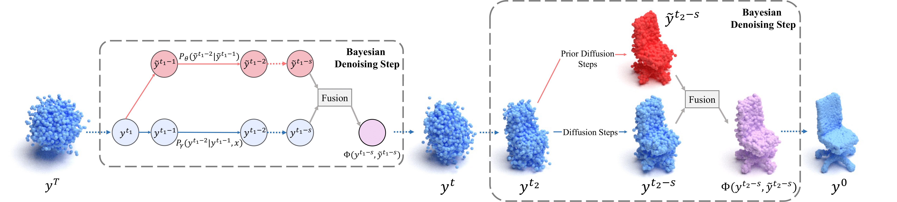
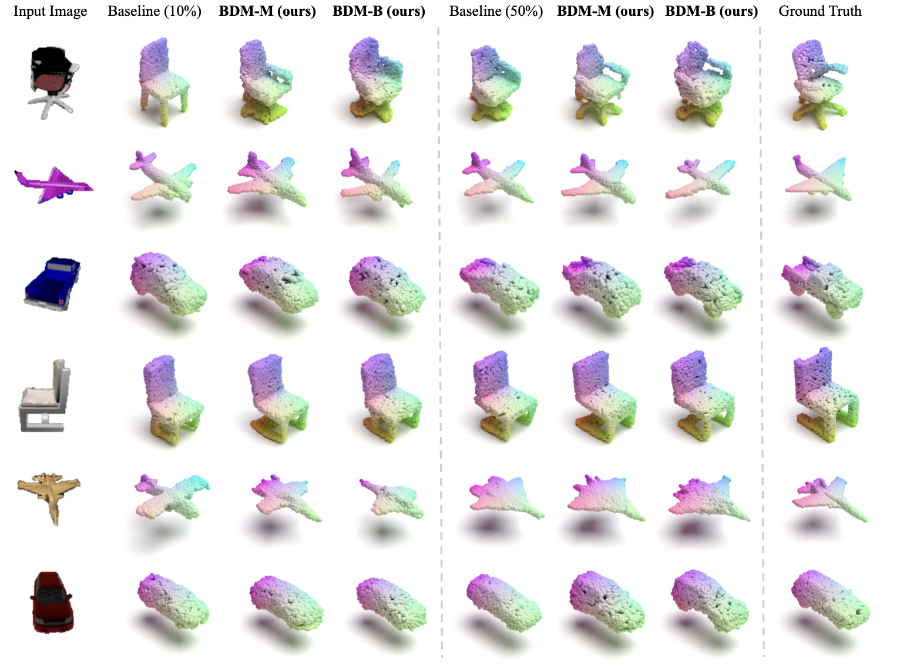

<div align="center">

## Bayesian Diffusion Models for 3D Shape Reconstruction

### CVPR 2024

[](https://arxiv.org/abs/2302.10668)
[](https://arxiv.org/abs/2302.10668)

</div>

## Table of Contents

- [Overview](#overview)
  - [Abstract](#abstract)
  - [Method](#method)
  - [Visualization](#visualization)
- [Running the Code](#running-the-code)
  - [Environment](#environment)
  - [Data](#data)
  - [Training](#training)
  - [Sampling](#sampling)
  - [Evaluation](#evaluation)
  - [Pretrained Checkpoints](#pretrained-checkpoints)
- [Acknowledgement](#acknowledgement)
- [Citation](#citation)

## Overview

### Abstract

We present Bayesian Diffusion Models (BDM), a prediction algorithm that performs effective Bayesian inference by tightly coupling the top-down (prior) information with
the bottom-up (data-driven) procedure via joint diffusion processes. We show the effectiveness of BDM on the 3D shape reconstruction task. Compared to prototypical deep
learning data-driven approaches trained on paired (supervised) data-labels (e.g image-point clouds) datasets, our BDM brings in rich prior information from standalone labels (e.g. point clouds) to improve the bottom-up 3D reconstruction. As opposed to the standard Bayesian frameworks where explicit prior and likelihood are required for the inference, BDM performs seamless information fusion via coupled diffusion processes with learned gradient computation networks. The specialty of our BDM lies in its capability to engage the active and effective information exchange and fusion of the top-down and bottom-up processes where each itself is a diffusion process. We demonstrate state-of-the-art results on both synthetic and realworld benchmarks for 3D shape reconstruction. Project link: https://mlpc-ucsd.github.io/BDM/.

### Method


Overview of the generative process in our Bayesian Diffusion Model. In each Bayesian denoising dtep, the prior diffusion
model fuses with the reconstruction process, bringing rich prior knowledge and improving the quality of the reconstructed point cloud. We
illustrate our Bayesian denoising step in two ways, left in the form of a flowchart and right in the form of point clouds.

### Visualization

#### ShapeNet-R2N2



#### Pix3D


## Running the Code

### Environment

1. Setting up conda environment:

```bash
# conda environment
conda create -n bdm
conda activate bdm

# python
conda install python=3.10

# pytorch
pip install torch==1.13.1+cu117 torchvision==0.14.1+cu117 torchaudio==0.13.1 --extra-index-url https://download.pytorch.org/whl/cu117

# pytorch3d
conda install -c fvcore -c iopath -c conda-forge fvcore iopath
pip install jupyter matplotlib plotly
pip install --no-index --no-cache-dir pytorch3d -f https://dl.fbaipublicfiles.com/pytorch3d/packaging/wheels/py310_cu117_pyt1131/download.html

# other dependencies
pip install -r requirements.txt
```

2. Please refer to PC^2's [common issues](https://github.com/lukemelas/projection-conditioned-point-cloud-diffusion?tab=readme-ov-file#common-issues) (2) and (3) to modify some package's source code.
3. Make sure you have gcc-8 and g++-8 installed:

```bash
apt install gcc-8
apt install g++-8
```

4. Wandb is used for logging. Please create an account and set up the API key.

### Data

#### ShapeNet-R2N2

Download [ShapeNet-R2N2](https://cvgl.stanford.edu/3d-r2n2/) (from [3D-R2N2](https://github.com/chrischoy/3D-R2N2)) and [ShapeNetCore.v2.PC15k](https://drive.google.com/drive/folders/1MMRp7mMvRj8-tORDaGTJvrAeCMYTWU2j) (from [PointFlow](https://github.com/stevenygd/PointFlow)). Unzip and put them under `experiments/data/ShapeNet/`. Then move `pc_dict_v2.json` and `pc_dict_v2.json` from `experiments/data/ShapeNet/` to `experiments/data/ShapeNet/ShapeNet.R2N2/`.

#### Pix3D

Download [Pix3D](http://pix3d.csail.mit.edu/data/pix3d.zip) (from [Pix3D](http://pix3d.csail.mit.edu/)). Unzip and put it under `experiments/data/Pix3D/`.

(We recommend to preprocess Pix3D with running `experiments/data/Pix3D/preprocess_pix3d.py` to save dataset loading time.)

After operations above, the `experiments/data/` directory should look like:

```
data
├── Pix3D
│   ├── pix3d
│   │   ├── img
│   │   ├── mask
│   │   ├── model
│   │   ├── pix3d.json
│   ├── pix3d_processed
│   │   ├── img
│   │   ├── model
│   ├── preprocess_pix3d.py
├── ShapeNet
│   ├── ShapeNetCore.R2N2
│   │   ├── ShapeNetRendering
│   │   ├── ShapeNetVox32
│   │   ├── pc_dict_v2.json
│   │   ├── R2N2_split.json
│   ├── ShapeNetCore.v2.PC15k
│   │   ├── 02691156
│   │   ├── ...
```

### Training

Example of training pc2 on 10% chair of ShapeNet-R2N2: [example_train.sh](experiments/example_train.sh).

Example of training BDM-Merging on 10% chair of ShapeNet-R2N2: [example_train_merging.sh](experiments/example_train_merging.sh).

### Sampling

Example of sampling (vanilla PC^2) using the pc2 trained above: [example_sample.sh](experiments/example_sample.sh).

Example of sampling (BDM-Blending) using the pc2 trained above: [example_sample_blending.sh](experiments/example_sample_blending.sh).

Example of sampling (BDM-Merging) using the pc2 trained above: [example_sample_merging.sh](experiments/example_sample_merging.sh).

### Evaluation

Example of evaluating the pc2 sampling results: [example_eval.sh](experiments/example_eval.sh).

### Pretrained Checkpoints

We refactored the repository for the public release and reproduce the result of PC^2, BDM-B and BDM-M. 

The checkpoints of chair with subset ratio of 0.1 are provided in this version of this code, and it should be easy to run on other categories and subset ratios if you need to.

For the prior model [PVD](https://alexzhou907.github.io/pvd), we provide an example checkpoint [train_chair_pvd_r2n2_1.0_2023-10-30](https://drive.google.com/file/d/1UgEacuCWCupokXHCRETHtqOY5FNwiZWH/view?usp=drive_link) here. You can put it under `ckpt/`.

For the reconstruction model [PC^2](https://github.com/lukemelas/projection-conditioned-point-cloud-diffusion), we provide an example checkpoint [train_chair_pc2_r2n2_0.1_2024-04-14](https://drive.google.com/file/d/15NDqJXyThb13BecCH0ma_P8BtIazMcmq/view?usp=drive_link) here. You can put it under `experiments/outputs/`.

For the BDM-Blending model [BDM-B](https://mlpc-ucsd.github.io/BDM), you can directly implement the sampling with the provided PVD and PC^2 checkpoints, as the BDM-Blending model is a simple blending of the two models without any additional training.

For the BDM-Merging model [BDM-M](https://mlpc-ucsd.github.io/BDM), we provide an example checkpoint [train_chair_pc2_r2n2_0.1_m-2024-04-19](https://drive.google.com/file/d/17LBxZN_pcmVfS0zBVtsoaF9LGoKnMR18/view?usp=drive_link) here. You can put it under `experiments/outputs/`.

You can run the sampling with our provided checkpoints, and get following result (left/right: reproduction/paper):

<table>

  <tr>
    <th colspan="1" align="center"></th>
    <th colspan="1" align="center">PC^2</th>
    <th colspan="1" align="center">BDM-M</th>
    <th colspan="1" align="center">BDM-B</th>
  </tr>

  <tr>
    <td align="center">CD</td>
    <td align="center">96.34/97.25</td>
    <td align="center">94.56/94.94</td>
    <td align="center">94.49/94.67</td>
  </tr>

<tr>
    <td align="center">F1</td>
    <td align="center">0.394/0.393</td>
    <td align="center">0.400/0.395</td>
    <td align="center">0.410/0.410</td>
</tr>

</table>

## Acknowledgement

Our code is built upon [Pytorch3D](https://github.com/facebookresearch/pytorch3d), [diffusers](https://github.com/huggingface/diffusers) and [PC^2](https://github.com/lukemelas/projection-conditioned-point-cloud-diffusion). We thank all these authors for their nicely open sourced code and their great contributions to the community.

## Citation

```
@article{xu2024bayesian,
  title={Bayesian Diffusion Models for 3D Shape Reconstruction},
  author={Xu, Haiyang and Lei, Yu and Chen, Zeyuan and Zhang, Xiang and Zhao, Yue and Wang, Yilin and Tu, Zhuowen},
  journal={arXiv preprint arXiv:2403.06973},
  year={2024}
}
```
